---
puppeteer:
  format: "A4"
  
  displayHeaderFooter: true
  headerTemplate: ' '
  footerTemplate: >
    <div style="font-size: 14px; width: 100%; text-align: center; padding: 0 1cm;">
      <span class="pageNumber"></span> / <span class="totalPages"></span>
    </div>
id: "test"
---
<!DOCTYPE html>
<html>
<head>
<meta charset="UTF-8">
<link rel="stylesheet" href="https://cdn.jsdelivr.net/npm/katex@0.16.9/dist/katex.min.css">
<script defer src="https://cdn.jsdelivr.net/npm/katex@0.16.9/dist/katex.min.js"></script>
<script defer src="https://cdn.jsdelivr.net/npm/katex@0.16.9/dist/contrib/auto-render.min.js"></script>
<script>
document.addEventListener("DOMContentLoaded", function() {
  renderMathInElement(document.body, {
    delimiters: [
      {left: "$$", right: "$$", display: true},
      {left: "$", right: "$", display: false}
    ],
    throwOnError: false
  });
});
</script>
</head>
<body>
</body>
</html>

<div class="cover-page">
  <div class="cover-main-title">
    Calculus
  </div>
  <div class="cover-subtitle">
    HW3:Understanding Limit/Continuity and Crystal Growth Limit Obsrvation
  </div>
  <div class="cover-group">
    組別：第15組
  </div>
  <div class="cover-authors">
    組員：<br>
    411485018 蘇星丞<br>
    411485002 楊昕展<br>
    411485003 胡庭睿<br>
    411485042 黃柏崴
  </div>
</div>


# Basic Concepts for Limits

## Q1
Evaluate the limit and justify each step by indicating the appropriate Limit Law(s)
1. $\lim_{x \to -3} (2x^3+ 6x^2 - 9)$
2. $\lim_{x \to 3} \sqrt[3]{x + 5}{(2x^2 - 3x)}$

## Ans1

1. 
$$
\begin{aligned}
&\lim_{x \to -3} (2x^3 + 6x^2 - 9) \\
&= \lim_{x \to -3} (2x^3) + \lim_{x \to -3} (6x^2) - \lim_{x \to -3} (9) && \text{(Sum/Difference Law)} \\
&= 2 \lim_{x \to -3} (x^3) + 6 \lim_{x \to -3} (x^2) - \lim_{x \to -3} (9) && \text{(Constant Multiple Law)} \\
&= 2(\lim_{x \to -3}x)^3+6(\lim_{x \to -3}x)^2-(\lim_{x \to -3}9) && \text{(Power Law)}\\
&= 2(-3)^3 + 6(-3)^2 - 9 && \text{(Appendix A 8,10)} \\
&= 2(-27) + 6(9) - 9 \\
&= -54 + 54 - 9 \\
&= -9
\end{aligned}
$$

2. 
$$
\begin{aligned}
&\lim_{x \to 3} \sqrt[3]{x + 5}{(2x^2 - 3x)} \\
&= \sqrt[3] {\lim_{x \to 3}(x+5)} \times \lim_{x \to 3}(2x^2-3x) &&\text{(Root / Product Law)}\\
&= \sqrt[3] {\lim_{x \to 3}(x+5)} \times (2\lim_{x \to 3}x^2 - 3\lim_{x \to 3}x) &&\text{(Sum / Difference / Constant Multiple Law)}\\
&= \sqrt[3]8 \times (2 \times 3^2-3\times3) &&\text{(Power Law)}\\
&= 2 \times 9\\
&=18
\end{aligned}
$$

***

## Q2
Evaluate the limit, if it exists.
1. $\lim_{x \to -2}(3x-7)$

2. $\lim_ {t \to 4}\frac{t² - 2t - 8}{t - 4}$

3. $\lim_{x \to 2}\frac{2-x}{\sqrt{x+2}-2}$

4. $\lim_{x \to 3} \frac{\frac{1}{x} - \frac{1}{3}}{x-3}$

## Ans2

1. Because $3x-7$ is a continuous function, which means $\lim_{x \to 2}3x-7 = 3\times 2-7(\text{continuous definition:}\lim_{x \to a}f(x) = f(a))$,so we can find out that the limit is $-1$

2. Because of the limit of the denominator is 0, so we need to perform algebraic simplification on the expression first.
$$
\begin{aligned}
&\lim_ {t \to 4}\frac{t² - 2t - 8}{t - 4}\\
&=\lim_{t \to 4}\frac{[(t-4)(t+2)]}{t-4}\\
&=\lim_{t \to 4}t+2 &&\text{(Cancel t-4)}\\
&=4+2\\
&=6
\end{aligned}
$$

3. We cannot apply Quotient Law because the limit of the denominator is 0, so we need to perform algebraic simplification on the expression first.
$$
\begin{aligned}
&\lim_{x \to 2}\frac{2-x}{\sqrt{x+2}-2} \times \frac{\sqrt{x+2}+2}{\sqrt{x+2}+2} \\
&= \lim_{x \to 2}\frac{(2-x)(\sqrt{x+2}+2)}{(\sqrt{x+2})^2-4} \\
&= \lim_{x \to 2}\frac{(2-x)(\sqrt{x+2}+2)}{x+2-4} \\
&= \lim_{x \to 2}\frac{(2-x)(\sqrt{x+2}+2)}{x-2} \\
&= \lim_{x \to 2}\frac{-(x-2)(\sqrt{x+2}+2)}{x-2} && \text{(Cancel x-2)}\\
&= \lim_{x \to 2}-(\sqrt{x+2}+2)  \\
&= -(\sqrt{2+2}+2) \\
&= -(2+2) \\
&= -4
\end{aligned}
$$


4. Same as the last question, because the limit of the denominator is 0, so we need to perform algebraic simplification on the expression first.

$$
\begin{aligned}
&\lim_{x \to 3} \frac{\frac{1}{x} - \frac{1}{3}}{x-3} \times \frac{x+3}{x+3}\\
&= \lim_{x \to 3}\frac{\frac{3}{x}-\frac{x}{3}}{x^2-9}\\
&= \lim_{x \to 3}\frac{\frac{1}{3x}(9-x^2)}{x^2-9} &&\text{(Cancel } x^2-9 \text{)}\\
&= \lim_{x \to 3} \frac{1}{3x}\times-1 \\
&= \frac{1}{9}\times -1\\
&= \frac{-1}{9}
\end{aligned}
$$


***
 

## Q3
Use Squeeze Theorom to show that 
$$\lim_{x \to 0}\sqrt{x^3+x^2}\sin{\frac{\pi}{x}}$$
## Ans3
$$ -1\leq\sin{\frac{\pi}{x}}\leq1\\$$
$$-\sqrt{x^3+x^2}\leq\sqrt{x^3+x^2}\sin{\frac{\pi}{x}}\leq\sqrt{x^3+x^2}$$
$$\lim_{x\to 0}-\sqrt{x^3+x^2}\leq\lim_{x\to 0}\sqrt{x^3+x^2}\sin{\frac{\pi}{x}}\leq\lim_{x\to0}\sqrt{x^3+x^2}$$
$$0\leq\lim_{x\to 0}\sqrt{x^3+x^2}\sin{\frac{\pi}{x}}\leq0$$
$$\lim_{x\to 0}\sqrt{x^3+x^2}\sin{\frac{\pi}{x}} = 0$$


***

## Q4
 The figure shows a fixed circle $C_1$ with equation $(x-1)^2 + y^2 = 1$ and a shrinking circle $C_2$ with radius $r$ and centering the origin
- Point $P(0,r)$
- Point $Q$ is the upper intersection point of the two circles
- Point $R$ is where line $PQ$ intersects the x-axis

What happens to point $R$ as circle $C_2$ shrinks (as $r \to 0^+$)?

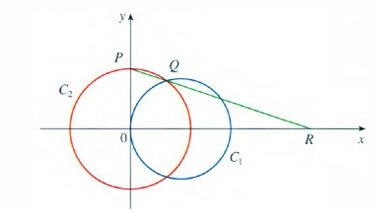
## Ans4
$$
\begin{aligned}
&x^2+y^2=r^2 \hspace{1cm} &\text{(1)} \\
&(x-1)^2+y^2=1 \hspace{1cm} &\text{(2)} \\
&\text{(1) - (2)}&\text{cancel}\hspace{0.2cm}  y^2\\
&2x-1=r^2-1\\
&x=\frac{r^2}{2}\hspace{1cm}y=\frac{r^2}{2}\\
&Q(x, y)=(\frac{r^2}{2}, \frac{r^2}{2})\\
&P(0,r)\\
\end{aligned}
$$
Find the slope $m_{\overline{PQ}} = 1-\frac{2}{r}$ 
Use P to find the equation of the line $L_{\overline{PQ}}=(1-\frac{2}{r})x =(y-r) $
so $R$ is fix on $x$ axias and to find $R$ we assume $R=R(k,0)$ 
plug in line L which gives us the equation equation$(1-\frac{2}{r})k =-r$ then simplify the equation and we will get the new equation $k = - \frac{r^2}{r-2}$

$$\lim_{r \to 0^+}k = \lim_{r \to 0^+}-\frac{r^2}{r-2} = 0$$
so as $r \to 0^+$ $\hspace{0.5cm}$ $R(k,0)\to (0,0)$
***
 
## Q5
Use the given graph of $f$ to find a number $\delta$ such that: $0 < |x - 3| < \delta\implies|f(x) - 2| < 0.5$


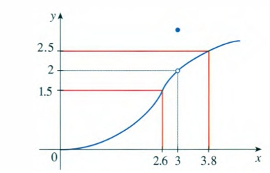
## Ans5
$
\begin{aligned}
&|f(x)-2| < 0.5\\
&1.5 < f(x) < 2.5\\
&f(x)=1.5\hspace{0.2cm}\text{as}\hspace{0.2cm}x = 2.6\\
&f(x)=2.5\hspace{0.2cm}\text{as}\hspace{0.2cm}x = 3.8\\
\end{aligned}
$
So when $x \in(2.6,3.8)$ then the inequality $|f(x) - 2| < 0.5$ will be satisfied
Given the inequality $0<|x-3|<\delta$ , the value of $\delta$  must ensure that the condition $|f(x)-2|<0.5$ is satisfied.
This means $\delta$  must be the smallest distance between 3 and the x-values where $f(x)=1.5$ and $f(x)=2.5$, which are 2.6 and 3.8 respectively.
Therefore, $\delta =\min (3-2.6,\  3.8-3)=\min (0.4,\  0.8)=0.4$.


***

## Q6
$f(x)=\sqrt{x}$ to find a number $\delta$ such that 
$$
\text{if } |x - 4| < \delta \text{ then } |\sqrt{x} - 2| < 0.4
$$
Explain the answer with a graph.

## Ans6
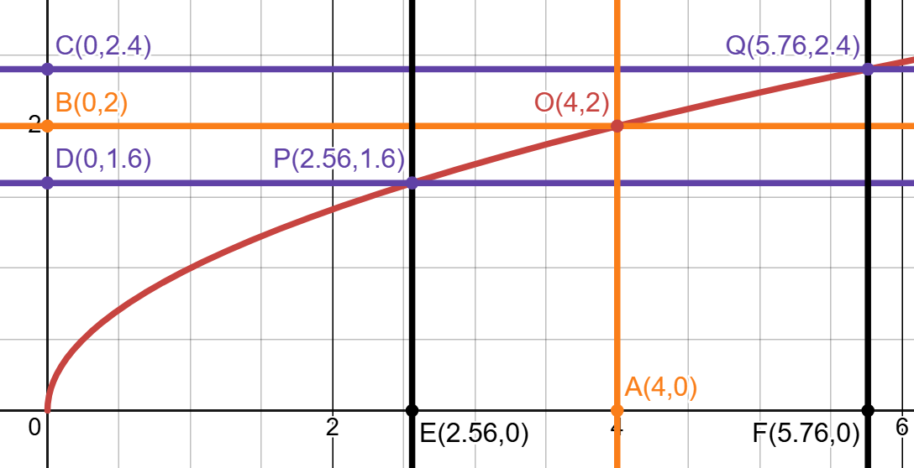

Juging from graph, at point P, the distance to point O along the y-axis is $\overline{BD} = 0.4$. The distance to point O along the x-axis is $\overline{AE} = 4 - 2.56 = 1.44$. At point Q, the distance to point O along the y-axis is also $\overline{BC} = 0.4$. The distance to point O along the x-axis is $\overline{AF} = 5.76 - 4 = 1.76$. However, the $\delta$ we are finding is an absolute value. That is, the distances from both sides to $x$ are equal. So, should $\delta$ be taken as 1.44 or 1.56? Since when we take the limit, the range can be made as small as we want, and the range of $\sqrt{x}-2$ must be within 0.4. If we take the larger value, the smaller side’s x could exceed the range we have set, that is $|\sqrt{x}-2| \ge 4$, so our $\delta$ must be taken as the smaller value. Therefore,
$\delta = 1.44$.


***

## Q7
Prove the following statements based on the precise definition of limits.

1. $\lim_{x \to 4} \frac{x^2 - 2x - 8}{x - 4} = 6$

2. $\lim_{x \to -6^+} \sqrt[8]{6 + x} = 0$
## Ans7
1.   First, we want to find a number $\delta$ such that if $0 < |x - 4| < \delta$ then $\displaystyle|\frac{x^2 - 2x - 8}{x - 4} - 6 | < \varepsilon$. 

Since
$$
\begin{aligned}
&|\frac{x^2 - 2x - 8}{x - 4} - 6| \\
&= |\frac{x^2 - 2x - 8}{x - 4} - \frac{6x - 24}{x - 4}| \\
&= |\frac{(x^2 - 2x - 8) - (6x - 24)}{x - 4}| \\
&= |\frac{x - 8x + 16}{x - 4}| \\
&= |\frac{(x - 4)^2}{x - 4}| \\
&= |x - 4|\end{aligned}
$$
We guess $\varepsilon = \delta $

Prove: Choose $\delta = \varepsilon$. If $0 < |x - 4| < \delta$, then $\displaystyle|\frac{x^2 - 2x - 8}{x - 4} - 6 | = |x - 4| < \delta = \varepsilon$.

Therefore, by the precise definition of a limit, $ \displaystyle \lim_{x \to 4} \frac{x^2 - 2x - 8}{x - 4} = 6$.

2. First, we want to find a number $\delta$ such that if $-6 < x < -6 + \delta$, then $| \sqrt[8]{6 + x} - 0| < \varepsilon$. Since $-6 < x < -6 + \delta$, $|\sqrt[8]{6 + x} - 0| < \varepsilon \implies |\sqrt[8]{6 + x}| < \varepsilon \implies \sqrt[8]{6 + x} < \varepsilon\ \implies 6 + x < \varepsilon^8 \implies x < \varepsilon^8 - 6$. We get $\varepsilon^8 = \delta$.

Prove:Choose $\delta = \varepsilon^8$. If $-6 < x < -6 + \delta$, then $| \sqrt[8]{6 + x} - 0 | = |\sqrt[8]{6 + x}| < |\sqrt[8]{6 + \delta - 6}| = |\sqrt[8]{\delta}| = |\sqrt[8]{\varepsilon^8}| = |\varepsilon|$, because $\varepsilon > 0$. That is, $| \sqrt[8]{6 + x} - 0 | < \varepsilon$.

Therefore, by the precise definition of one-sided limit, $\displaystyle \lim_{x \to 4} \frac{x^2 - 2x - 8}{x - 4} = 6$.
***

## Q8
Prove that $ \lim_{x \to -3} \frac{1}{(x+3)^4} = \infty$ using the precise definition of an infinite limit.
## Ans8
First, we want to find a number $\delta$ such that if $\displaystyle 0 < |x - (-3)| < \delta$, then $\displaystyle \frac{1}{(x+3)^4} > M$ (holds for all positive numbers). $\displaystyle \frac{1}{(x+3)^4} > M \implies \frac{1}{M} < (x+3)^4 \implies \sqrt[4]{\frac{1}{M}} < x + 3 \implies \sqrt[4]{\frac{1}{M}} < |x + 3| \implies \sqrt[4]{\frac{1}{M}} < |x - (-3)|$, we get $\displaystyle |x - (-3)| > \sqrt[4]{\frac{1}{M}}$.

Prove:
if $\displaystyle 0 < |x - (-3)| < \delta = \sqrt[4]{\frac{1}{M}}$, then $\displaystyle\frac{1}{(x+3)^4} > M$(holds for all positive numbers).

Therefore, by the precise definition of an positive infinite limit,$\displaystyle \lim_{x \to -3} \frac{1}{(x+3)^4} = \infty$.

<!-- pagebreak -->

# Basic Concepts for Continuity

## Q1
Prove that $f$ is continuous at $a$ if and only if
$$ \lim_{h \to 0} f(a + h) = f(a) $$

## Ans1
Prove: $f$ is continuous at $a$  $\iff \lim_{h \to 0} f(a + h) = f(a)$

From class's slides, we know that the definition of continuous is $\lim_{x \to a}f(x) = f(a)$

### Part 1 : Foward direction's proof
Assume f is continuous at a, we know by the definition of continuous $\lim_{x \to a}f(x) = f(a)$.

Define a variable h , and set $x = a + h$, when $x$ $\to$ $a$, $h \to 0$

Now we can replace $x$ with $a+h$ and the limit condition $x \to a$ with $h \to 0$
$$\lim_{h \to 0}f(a+h) = f(a)$$

From above, it have proven that if $f$ is continuous at $a$, then the given limit expression holds true.

### Part 2 : Reverse direction's proof

Assume $\lim_{h \to 0} f(a + h) = f(a)$, and we want to prove f is continuous at a

According to above, we define $x = a+h$, which means $h = x-a$

As $h \to 0$, the value of $x$$\text{(a+h)}$ must approach $a+0$, so we can know as $h \to 0$,then $x \to a$

Now we can replace $h$ with $x-a$ and the limit condition $h \to 0$ with $x \to a$
  $$ \lim_{x \to a} f(a + (x - a)) = f(a) $$
After simplify:
$$ \lim_{x \to a} f(x) = f(a) $$

From above, it have proven that if $\lim_{h \to 0} f(a + h) = f(a)$ is true, f is continuous at a.

### Conclusion
Since we have proven the statement in both directions , we have successfully shown that a function f is continuous at a if and only if $\lim_{h \to 0} f(a + h) = f(a)$.

***

## Q2
The graph of a function f is given.
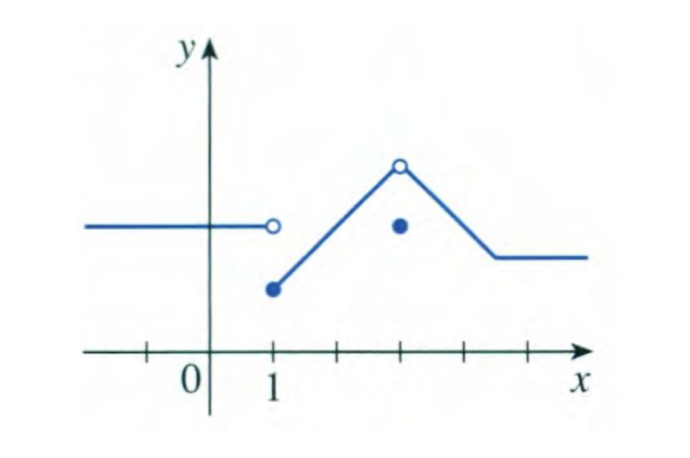

1. At what numbers a does $\lim_{x \to a}f(x)$ not exist?

2. At what numbers a is f not continuous?

3. At what numbers a does  $\lim_{x \to a}f(x)$ exist but f is not continuous at a?

## Ans2
* The criteria for limits, continuity, and differentiability can be found in Appendix B

1. $x=1$, because $lim_{x\to 1-}f(x) \neq lim_{x\to 1+}f(x)$ 

2. $x=3$, because $\lim_{x\to 3}f(x) \neq f(3)$

3. $x=3$, according to Appendix B, although left-hand limit equals to right-hand limit and both exist(conditions for the existence of a limit), $\lim_{x\to 3}f(x) \neq f(3)$, from above we can know that $f$ is not continuous at $a$.

***

## Q3
Use the definition of continuity and the properties of limits to show that the function is continuous at the given number a.<br>
 1. $f(x) = 3x^2+(x+2)^5, a = -1$
 2. $p(v) = 2\sqrt{3v^2+1}, a = 1$
 
## Ans3


So the definition of continuity at a certain point is consisted of three parts:


(1): The limit of the function at the point exists: $\lim_{x \to a} f(x) \text{ exists}$
(2): The value of the function at the point exists: $f(a) \text{ is defined}$
(3): The limit equals the function value: $lim_{x \to a} f(x) = f(a)$

<hr>

1. 
$$
\begin{aligned}
&\lim_{x \to -1} f(x) = 4 \\
&f(-1) = 4 \\
&\lim_{x \to -1} f(x) = f(-1) \\
&\text{Therefore, $f(x)$ is continuous at $x = -1$}\\
&\end{aligned}
$$


2. 
$$
\begin{aligned}
&\lim_{v \to 1}p(v)=4\\
&p(1) =4\\
&\lim_{v\to1}p(v)=p(1)\\
&\text{Therefore, $p(v)$ is continuous at $v = 1$} 
&\end{aligned}
$$

***

## Q4
Use properties of limits to evaluate the limit.

1. $ \lim_{x \to 2} x \sqrt{20 - x^2}$

2. $ \lim_{\theta \to \frac{\pi}{2}} \sin(\tan(\cos\theta))$ 
## Ans4
1. First, separate $x \sqrt{20 - x^2}$, and consider $x$ and $\sqrt{20-x^2}$ individually. $x$ is a polynomial function. That mean, on its domain $\{x | x \in \mathbb{R}\}$, it must be continuous. And $\sqrt{20-x^2}$ is a root function, it must also be continuous on its domain $\{ x \in \mathbb{R} |  -\!\!\sqrt{20} \le x \le \sqrt{20} \}$. According to the properties of continuity, $x \sqrt{20 - x^2}$ must be continuity,  with the range $-\!\!\sqrt{20} \le x \le \sqrt{20}$. Next, since $x = 2$ is within this range, let $x \sqrt{20 - x^2}$ is \(f(x)\). Therefore, $\displaystyle \lim_{x \to 2} x \sqrt{20-x^2} = f(2) = 2 \sqrt{20 - 2^2} = 2 \sqrt{16} = 2 \cdot 4 = 8$. Or, $\displaystyle \lim_{x \to 2} x \sqrt{20-x^2} = (\lim_{x \to 2}x)(\lim_{x \to 2}\sqrt{20-x^2})=2 \sqrt{16} = 2 \cdot 4 = 8$(Product Law).

2. $\sin \theta$, $\cos \theta$, and $\tan \theta$ all are trigonometric, and they are continuous on their domains. Except for $\tan \theta$, whose domain is $\{\theta\in \mathbb{R}| \cos \theta \neq 0 \}$, that is $\theta \neq \frac{\pi}{2} + k (k \in \mathbb{Z})$, the domains of the other two functions are $\{\theta | \theta \in \mathbb{R}\}$. Since $\cos \theta$ has a value of 0 at $\theta = \frac{\pi}{2}$, it is continuous, and $\tan (\cos \frac{\pi}{2}) = \tan (0) = 0$ is continuous. According to the continuity theorem, $\tan (\cos \theta)$ is continuous at $\theta = \frac{\pi}{2}$. We can get $\ \lim_{\theta \to \frac{\pi}{2}}\tan(\cos \theta) = 0$.<br>Next, consider $\sin(\tan(\cos\theta))$. Since $\tan (\cos \theta)$ has a value of 0 at $\theta = \frac{\pi}{2}$, it is not defined. Let $b = \tan (\cos \frac{\pi}{2}) = 0$. From $\sin b = \sin 0 = 0$, we can know sin b is continuous at $b$, and $ \lim_{\theta \to \frac{\pi}{2}}\tan(\cos \theta) = 0 = b$. According to the continuity therom, $ \lim_{\theta \to \frac{\pi}{2}}\sin b = \lim_{\theta \to \frac{\pi}{2}}\sin (\tan (\cos \theta)) = \sin (\lim_{\theta \to \frac{\pi}{2}}\tan (\cos \theta)) = \sin 0 = 0$.


# Crystal Growth Inspection

## test_crystal_growth.py

```python
import numpy as np
import matplotlib.pyplot as plt
from crystal_growth import *

def viz_limit(target_temperature, eps, target_power, delta, power_range):
    min_power = power_range[0]
    max_power = power_range[1]

    w_values = np.linspace(min_power, max_power, 500) # 在功率範圍內取 500 個點

    T_values = np.array([get_temperature(w_value) for w_value in w_values]) # 計算每個功率對應的溫度
    
    # Begin plotting
    plt.figure(figsize=(10, 6)) # 設定圖片大小
    plt.plot(w_values, T_values, label='T(w) = 0.1w² + 2.155w + 20', color='black') # 畫橫軸w_values、縱軸T_values、設定圖形標籤T(w) = 0.1w² + 2.155w + 20、設定顏色為黑色
    # Plot point at T=200
    plt.scatter([target_power], [target_temperature], color='black', zorder=5)# 在(x, y) = (target_power, target_temperature)劃一個黑點
    plt.axhline(y=target_temperature, color='gray', linestyle='--')  # Horizontal line at T=target_temperature
    plt.axvline(x=target_power, color='gray', linestyle='--')  # Vertical line at target_power
    plt.text(target_power + 0.1, target_temperature + 0.1, f"w = {target_power:.3f}", fontsize=9)#在點(x, y) = (target_power, target_temperature)上方 0.1 的地方寫出文字target_power(小數點後三位)並設定大小 9
    
    # Plot horizontal lines as epsilon bounds
    y_high = target_temperature + eps
    y_low = target_temperature - eps # 溫度在 eps 範圍內的上下界
    plt.axhline(y=y_high, color='red', linestyle='-', label='eps bounds')
    plt.axhline(y=y_low, color='red', linestyle='-')
    plt.vlines(target_power, y_low, y_high, color='red', linestyle='dashed')
    plt.text(power_range[0]+0.2, y_high+1,
            f"T = {target_temperature:.3f} + {eps:.3f}", color='red', fontsize=9, va='bottom')

    plt.text(power_range[0]+0.2, y_low-1,
            f"T = {target_temperature:.3f} - {eps:.3f}", color='red', fontsize=9, va='top')
    
    # Plot vertical lines as delta bounds
    x_left = target_power
    x_right = target_power
    delta = max(abs(target_power - lower_power), abs(higher_power - target_power))# 計算在溫度誤差範圍 1 內時，功率的最大偏差(delta)
    x_left = target_power - delta
    x_right = target_power + delta # 算出 X 的左右範圍
    plt.axvline(x=x_left, color='blue', linestyle='-', label='delta bounds')
    plt.axvline(x=x_right, color='blue', linestyle='-')
    plt.hlines(target_temperature, x_left, x_right, color='blue', linestyle='dashed')
    min_temperature = get_temperature(min_power)
    plt.text(x_right+0.05, min_temperature+1,
            f"T = {target_power:.3f} + {delta:.3f}", color='blue', fontsize=9)

    plt.text(x_left-0.7, min_temperature+1,
            f"T = {target_power:.3f} - {delta:.3f}", color='blue', fontsize=9)
    
    # Labels and title
    plt.title("Crystal Growth Temperature Control") # 設定標題名稱
    plt.xlabel("Power Input (w)") # X 座標設為 w
    plt.ylabel("Temperature T(w)") # Y座標設為 T
    plt.grid(True) # 加上格線
    plt.legend() # 顯示圖例標籤
    plt.savefig("limit.png", dpi=300, bbox_inches='tight') # 儲存為 limit.png
    plt.close()  # Close the figure to free memory
    
# Solve powers
target_temperature = 200
eps = 1
target_power = solve_power(target_temperature)
higher_power = solve_power(target_temperature+eps)
lower_power = solve_power(target_temperature-eps)# 描寫溫度的誤差(eps)範圍
power_range = [target_power-2, target_power+2]# 設定功率範圍
delta = max(abs(higher_power - target_power), abs(lower_power - target_power))# 溫度在誤差 1 的範圍內，功率的最大偏差值就是要的 delta
 

print(f"Power needed to maintain 200°C: {target_power:.3f} W")
print(f"Allowed power range for ±{eps}°C: [{lower_power:.3f}, {higher_power:.3f}] W")
print(f"Corresponding delta: {delta:.3f} W")


# Draw the graph
viz_limit(target_temperature, eps, target_power, delta, power_range)# 畫出eps delta圖
```

***

## crystal_growth.py

```python
import math

def get_temperature(power):
    temperature = 0.1 * power ** 2 + 2.155 * power + 20 # 計算在 power 時的 T
    return temperature # 回傳 temperature

def solve_power(temperature): # 從溫度反推功率
    power = 0

    a = 0.1
    b = 2.155
    c = 20 - temperature
    
    discriminant = b**2 - 4*a*c # 判別式大於 0 時才有實根
    if discriminant >= 0:
        sqrt_d = math.sqrt(discriminant) # 取平方根
        root1 = (-b + sqrt_d) / (2*a)
        root2 = (-b - sqrt_d) / (2*a)
        power = max(root1, root2) # 取較大的值(正根)

    #Note: Only return the positive root

    return power
```
程式圖形:

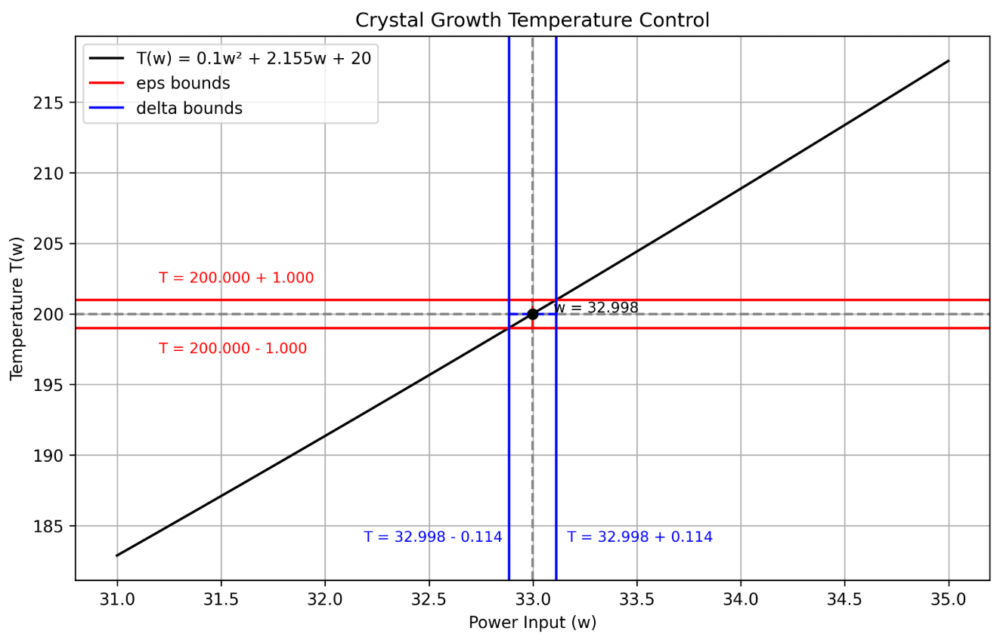

終端機測資:


Crystal growth furnaces are used in research to determine how best to manufacture crystalsused in electronic components. For proper growth of a crystal, the temperature must becontrolled accurately by adjusting the input power. Suppose the relationship is given by $ T(w) = 0.1w ^ 2 +2.155w +20$ where T is the temperature in degrees Celsius and w is the power input in watts. 

## Q1:
How much power is needed to maintain the temperature at $ 200^\circ\mathrm{C}$ ?

## Ans1:
$ T(w)=0.1w^2+2.155w+20=200$
$ \quad \Rightarrow \quad$
$ 0.1w^2+2.155w+20-200=0\quad \Rightarrow \quad 0.1w^2+2.155w-180=0$

$ w=\frac{-2.155\pm \sqrt{(2.155)^2-4\cdot 0.1\cdot (-180)}}{2\cdot 0.1}
w=\frac{-2.155\pm \sqrt{4.646025+72}}{0.2}=\frac{-2.155\pm \sqrt{76.646025}}{0.2}
w\approx \frac{-2.155\pm 8.756}{0.2} = 33.005 or -54.555$，take positive one，$ w = 33.005$

***
## Q2:
If the temperature is allowed to vary from $ 200^\circ\mathrm{C}$ by up to $ ±1^\circ\mathrm{C}$ , what range of wattage is allowed for the input power?

## Ans2:
when $ 199^\circ\mathrm{C}$

$ 0.1w^2+2.155w+20=199\Rightarrow 0.1w^2+2.155w-179=0$

Use the quadratic formula:

$w=\frac{-2.155\pm \sqrt{(2.155)^2-4\cdot 0.1\cdot (-179)}}{2\cdot 0.1}$

 $w\approx \frac{-2.155\pm \sqrt{4.646+71.6}}{0.2}=\frac{-2.155\pm \sqrt{76.246}}{0.2}$

$ w\approx \frac{-2.155\pm 8.73}{0.2}\Rightarrow w_{\mathrm{low}}\approx 32.88$

when $ 201^\circ\mathrm{C}$

$ 0.1w^2+2.155w+20=201\Rightarrow 0.1w^2+2.155w-181=0$

$ w=\frac{-2.155\pm \sqrt{(2.155)^2-4\cdot 0.1\cdot (-181)}}{0.2}=\frac{-2.155\pm \sqrt{4.646+72.4}}{0.2}=\frac{-2.155\pm \sqrt{77.046}}{0.2}$

$ w\approx \frac{-2.155\pm 8.78}{0.2}\Rightarrow w_{\mathrm{high}}\approx 33.12$

range of wattage is 33.12 < w < 32.88


***
## Q3:
Draw the graph to illustrate the limit interms of the $\varepsilon , \delta $ definition of $ \lim _{x\rightarrow a}f(x)=L$ .

## Ans3:

let f(x) = x, a = 1

$\forall a,  \lim _{x\rightarrow a}f(x)=a$

$ \because \forall \varepsilon >0,\exists \delta >0\mathrm{\  such\  that\  }0<|x-a|<\delta \Rightarrow |f(x)-a|<\varepsilon $,  $ f(x)=x$

$ \therefore |f(x)-a|=|x-a| $

when $ \varepsilon = \delta$ , $ \lim _{x\rightarrow a}f(x)=L$ is established.


<!-- pagebreak -->

# Work Division

| 學號/姓名 | 分配項目（寫） | 分配項目（檢查） |
| --- | --- | --- |
| 411485002 楊昕展 | part1: 6, 7, 8<br> part2: 4 | part 2 3,4  |
| 411485003 胡庭睿 | part 1:1,2<br> part 2:1,2<br> Appendix A,B| 程式部分 |
| 411485018 蘇星丞 | part1: 3, 4, 5<br> part2: 3 | part 2 1,2 |
| 411485042 黃柏崴 | 程式部分 | part1: 1 ~ 8 |


# Challenges and Difficulties

 
### 姓名： 胡庭睿
### 遇到的困難與挑戰：
1. markdown轉pdf
在上次作業中使用的extension(markdown pdf)，在轉換多行latex公式時(ex: \begin{aligned})會無法辨別，於是我在網上尋找許多不同方法，但是轉換的效果都不令我滿意，pandoc雖然能夠很好的渲染出latex公式，但是圖片的位置卻無法置中，換了很多個latex engine依然無解(pdflatex, mactex, xetex,basictex)再加上標題頁是用html寫的， 也意味著標題頁需要重寫，但是我卻一直無法將它修改到我想要的樣式，最後我找到了一個叫做markdown preview enhanced的extension,對latex公式有很好的支援度，字體以及版面等也都可以透過.less控制，有不錯的自訂度，只是文檔寫的不太詳細，花了我一點時間才解決，不過我也學到了許多。


2. latex撰寫作業
經過作業一的批改後，我更了解老師的評分標準，應該更詳細的列出思考以及計算過程，也代表用latex撰寫的佔比會更高，我學到了要打多行運算式時，可以用\begin{aligned} 和 \end{aligned}，用\begin{align}會讓每一行運算式後有編號，並且用&可以將算式對齊，在這次作業中也花了不少時間學習latex的語法。不過像part 1 ans 1中的公式，雖然可以使它們與第一行算式對齊，但是我並沒有辦法控制所有算式的位置是在中間還是左邊，寫的方式完全一樣，但是卻依然無法改善此問題，推測是markdown轉換為html時出錯。

3. 全英文撰寫作業
全英文撰寫作業是這次作業我給我自己的挑戰，我發現在上課的簡報中，太容易依賴翻譯去查詢那些數學專有名詞，寫上中文解釋後下次上課依然還是會忘記，真正用英文開始寫後，我發現有好多在數學算式中常用到的詞彙，像是假設(assume)，代數化簡(algebraic simplification)，function的定義錯誤(ill-definition)等，很多都是生活中常用到的單字但是會讓人想不到可以這樣運用，透過這次作業也讓我更熟悉這些數學的英文專有名詞，也期許自己能夠越來越熟悉，到最後可以能夠像母語一樣順利的運用。
4. review code部分
這次負責程式部分的組員算是第一次學習python，很多python的基本概念都並不太了解，他一開始以為要在終端機輸入溫度，程式會輸出所需要的功率，但是作業範本根本就沒有input()的部分，還有像是#TODO做完通常都會刪除，但是他直接將整個code 複製貼上，最後我詳細講解的#TODO的含義，以及幫他加了三行print，將作業題目中要求的答案print出來，幫助他對每個函數的理解。


***

### 姓名： 蘇星丞
### 遇到的困難與挑戰：
1. git的問題
git是我這次作業第一次用，其中碰到了很多問題像是版本衝突、不會用終端機、指令不太熟悉。有一次版本衝突時我不知道他到底出了甚麼問題，他也沒有問我要不要覆寫或修改之類的，然後又不知道他的錯誤訊息到底甚麼意思，所以很著急，好在之後他跳出警示框讓我直接覆寫那段程式不然我也沒辦法自己處理，中間有問了同組的成員及AI，學到了本來不會學到的知識，之後我也有去提升我對git的認識，這讓我在操作git和處理問題上有更多的知識，不會的地方也比較明顯，讓我有辦法找尋相關的資源。
2. markdown跟latex
這次寫作業都是用markdown和latex寫，這和之前用的工具截然不同，一方面覺得數學式啊，那些專業或不常見的表達方式可以更直觀的表達出來，另一方面覺得設計跟排版的部分特別的麻煩跟困難，所以排版的公式我都請AI跟我講，雖然還是排的不怎麼樣，但是至少比一開始好多了。

***

### 姓名： 黃柏崴
### 遇到的困難與挑戰：
1. git共編與
這是我第一次接觸 git共編，使用中常常會怕不小心沒有 pull 到資料而把別人的部分蓋掉，而且對指令的操作部分也不太熟，但有求助厲害的組員。像是git add .的意思是把資料存到暫存區，git commit -m的意思是把暫存區中的變更提交到本地版本庫，而git pull --rebase的意思是先把遠端的更新拉下來，然後再把本地的提交重新套用在最新的遠端版本上，--rebase是類似排隊的功能，希望未來能完全熟悉這項技能，成為別人口中厲害的組員。
2. latex編輯
開始利用latex寫報告讓我意識到他的方便，這是大學前完全接觸不到的技巧，他可以以更專業的方式、符號直觀的表達出來，而且有了上次作業的經驗，這次報告的書寫比上次順手得多，但還是有些不足，我還是時常需要詢問 AI，只是更知道該用甚麼方式去寫。這些經歷讓我對他們更加熟悉，他能讓撰寫報告變得更加方便而且也省去一個個抓的排版，未來在考研或其他需要做報告的時候，有這些經驗也會讓我更加得心應手。
3. 作業內容
這次作業我所花費的時間算是比以往多很多，我認為第一個原因是我對程式的不熟悉，很多地方還須找答案，好在順利的完成功課，第二個是我在這次報告我們組採用新的共編與組員決定用英文撰寫報告，而我在報告寫答案的時候增加英文使用量，可惜程式註解部分沒用，在下次輪到我程式的話我會改用註解，在題目3的部分我看不太懂，求助組員才知道要用甚麼方式去寫。

***

### 姓名： 楊昕展
### 遇到的困難與挑戰：
1. latex編輯
完成Hw1時，我幾乎沒接觸到這latex語法(有初步學習)，所以我下定決心Hw3要開始使用，但是，還有另個難題，git共編，完全了解不了。所以我先完全不理它，自行到overleaf先學習latex，學習latex時，雖然Hw2時有看overleaf的註冊完的教學，實際開始時，簡直大腦空白。所以耗費六個小時搞清楚、寫完環境排版與教授的題目，不會的請教AI，題目完全沒碰。\usepackage{xeCJK}可以支援中文、\usepackage{amsmath, amssymb}可以使用更多類型的數學公式等\usepackage，但再來，我學會更多框架，像是qustion計數器，使用newcounter、排版置中用centering。隔天，花了四個小時完成程式部分，用AI學接下來latex公式的部分，舉例來說，每個必須用\\(\\)包住(後來由於markdown，只能乖乖改回$$)，地一個學的是lim，\lim_{x \to 0}，剛開始一直忘記底線_，還有，\delta、\displaystyle、\infty、\ge、\approx、\varepasilon、\implies這些已經非常熟悉了，最後也成功把我的部分在overleaf完成。(後來發現這些其實最簡單)

2. git共編
雖然hw2就使用github了，但那時是組員胡同學全程控制，我把完成部份給他，沒有共編，其實根本完全不了解git，但到了這次作業報告，不僅要學latex，開始了解git成了最困擾的問題(說實話，現在還是不太了解，只懂些操作概念)，我從overleaf上的latex，變成要了解怎麼操作git，像是在termial，git pull把資料先載下來，接著git add.與git commit -m""命名存取，最後git push存到github，這些都是蘇同學、胡同學教我如何操作的，非常感謝他們。

3. markdown格式要求、中翻英
雖然了解概念，但我最麻煩的是，把overleaf上的全部latex格式除了公式，大都改成markdown，還有因為我第一次直接用英文寫不太懂此語言在數學的樣式，所以把寫完的部份移到VScode(我們用的環境)非常困擾我，我最後的解決辦法是每題問AI翻譯，再把每個\\(\\)改成$$(其實剛開始想偷懶直接全部丟給AI改，但最後latex語法行不通，甚至他把我的回答改的亂七八糟)。我當時以為每個字都要翻譯，但其實只有我寫的第一題而已，剩下的大都都用自己的話寫，我也驚訝到了，下次打算直接用英文完成。

4. 作業內容
除了上述主要三點的困難，這次作業與先前作業內容都是高中內容不同，開始有新的微積分知識要開始學習，我認為較困難的部分可分三種。第一困難的是第一部份的Q6，我不太了解教授出題的意思，自己作圖完全由圖中判斷，還是以圖來發展公式，最後我決定兩種方式都寫，我發現更能了解 $\delta$ 與 $\varepsilon$ 來表示更準確極限定義。第二種困難的部分是第一部份的Q7、Q8，由於上課聽不太懂，只懂雙邊的證明方法，但要證明單邊和 $\infty$ 的特例時，卻手足無措，我的解決辦法是，先看教授的投影片，用類似方式推導，不過，在其中發現教授投影片的定義範圍沒加絕對值(定義有)，所以最後還能加深印象。第三個部分是Q4，以我們以前學的，直接帶入 $x \to $ 的值答案就出來了，然而為了順應教授要求必須用連續的特性，所以我看上課投影片很久。總結來說，我每個問題寫前的看三次，思考兩次，完成後移到VScode又看了四次，建立微積分基礎的底子。
# Meeting Records

| 會議日期 | 會議方式 (線上/實體) | 討論事項 | 詳細內容 |
| :--- | :--- | :--- | :--- |
| 10/31(五)中午 | 線上 | 分工，討論寫的格式(最終github)|期中考後立刻在discord討論，組員提醒分組以及投票決定作業撰寫方式<br>(details in Appendix C)| 
| 11/1(六)凌晨~11/2(日)| 線上 | 圖書館討論時間、何時完成|最終投票決定在禮拜三開會，只是大家有其他活動，最終沒有成效<br>(details in Appendix C)||
| 11/3(一)中午、下午| 線上 | 胡同學給git學習資源(youtube與自己打的)、開github repo|(details in Appendix C)|
| 11/5(三)中午(40分鐘)| 實體 | 檢討hw1哪裡錯、改進|主要問題是未檢查出多數題目的錯誤，再來我們的繳交作業流程有誤<br>(details in Appendix C)|
| 11/6(四)下午(三小時)| 實體 | 蘇同學與胡同學到圖書館學習與教git、做報告，黃同學後來也有到 |解決Git 的版本衝突問題，LaTeX 的排版問題<br>將答案的文字敘述從 \text{}語法中移出改善格式<br>解決程式環境，協助安裝pip 套件|
| 11/9(日)、10(一)下午| 線上 | 蘇同學、黃同學與胡同學討論git的pull及push問題 |詳細見appendix|
| 11/10(一)晚上| 線上 | 蘇同學、黃同學與胡同學討論git的pull及push問題|因為編輯了同個檔案，若要把origin main pull下來，<br>要先把自己的修改加入暫存區<br>(details in Appendix C)|
| 11/11(二)下午、晚上| 線上 | 黃同學與胡同學討論程式問題(discord直播)、楊同學有問點latex及markdown格式疑點 |(details in Appendix C)|
| 11/12(三)下午(兩個小時)| 實體 | 楊同學、黃同學與胡同學到圖書館reviewer作業部份與剩下部分(蘇同學有提早)與程式問題 |胡同學教楊同學處理版本衝突的處理問題|
| 11/12(三)晚上| 線上 | 最後總結，報告排版，檢查問題|我們每人都有看一下報告整體，胡同學有提醒worling hours 要寫詳細，這是hw1錯誤的改正。詳細見appendix|


# Working Hours Records

| 組員姓名 | 工作時數 | 工作項目 | 工時高/低原因分析 (Bonus) |
| :--- | :--- | :--- | :--- |
| 胡庭睿 | 20hr | 1. part 1:1,2 (1hr)<br> 2. part 2:1,2 (2hr)<br> 3. Appendix A,B (4hr)<br> 4. the report template (3hr)<br> 5. git and github tutorial(2hr)<br>6. find ways of converting markdown to pdf (8hr)<br>7. improve whole team workflow on report(2hr)|Cause I've done my part early, so I spend more time on the better way the report could be represent in. <br> Also before writing tutorial and finding ways to convert markdown to pdf,these pretest took me tons of time.<br>For example I create a new repo to test out version conflict problems that could happen. Though it takes a lot of time, I really enjoy learning from it.|
| 蘇星丞| 5hr | 1. part1: 3, 4, 5 (1hr)<br>2. part2: 3 (1hr)<br>3.learning latex and git (3hr)  | except the part of writting the homework, i did less in addtional works. |
| 楊昕展 | 12小時 | 1. part1: 6, 7, 8<br>2. part2: 4 | Actually doing my parts took about 6 hours because practing Latex approach 6 hours.  |
| 黃柏崴 | 9.5hr | 1. the program parton (5.5hr)<br> 2. write report (4hr)| make TODOs and write annotations after understand the program .<br> try to use some English in the report .|


# Reflection


### 學號：411485003
### 姓名：胡庭睿
### 心得：
這次作業的時間點剛好在作業一的成績發佈之後，老師對作業的layouts, writing styles,reflection and team's distribution to the work也變得更清楚，為了更好的統一writing styles，首先我根據作業二用markdown混合latex的方式撰寫了修正過後的模板，不僅能夠統一組員的writing styles也可以更貼近老師的要求，再來用markdown + latex的好處是不用碰觸到latex排版，同時也能學習如何用latex的語法寫數學公式，最後則是處理上次作業中提及的共編問題，我寫了git 和 github的教學文檔，教了組員們必要的git知識，即使還是遇到了常見的版本衝突問題，花了一段時間才解決，但是我也同樣學到了許多。

作業的部分我其實沒有太大的問題，可能是因為高中微積分教的比較扎實的緣故，作業的難度並沒有高到我無法接受的程度，在寫作業的過程，邊寫邊對照簡報提及的公式內容令我受益良多，我能夠更好的記住這些公式的英文名稱，且在看簡報的過程中，順便整理了一下簡報的所有公式，仔細梳理連續，極限，微分這三者之間的關係與差異，是整個作業中我收穫最大的部分。

從這次的作業中，我個人學到了許多關於安排教學進度和教學組員的技巧，在這之前，我比較不擅長表達自己的想法，就只是做好別人指派給我的工作，但是在與組員交流過後，我發現組員也和我很像，但是這樣作業會開天窗，所以我想要先試著改變自己，嘗試多與組員交流，了解他們吸收知識的程度，並且動態調整我們想要新學習的內容。目前我們的workflow仍有很大的優化空間，下次作業的部分我想要試著讓組員學習git branch，目前組員對git 仍然不是很熟悉，有時會不小心將別人修改過的版本覆蓋掉，branch就能夠很好的解決這個問題，只需最後在merge就好，最後我的目標希望能夠讓組員間的分工與共編變得更加流暢。

團隊工作風格的部分，我認為我們可以更早的開始進行作業討論，即使都還沒預覽題目也沒關係，約個時間一起討論並且同時做效率也會比較高，我也更能夠掌握組員的學習狀況，且更好講解學習事項的原理以及方法，只是要約到四個人同時有空的時間真的好難:(。還有組員們的feedback對我來說很重要，雖然我很早就把自己作業的部分包含教學文檔處理完，還加上了youtube補充影片，但是傳了訊息後大家都沒仔細看，結果剩下最後幾天大家開始做時，每個人都在問我教學文檔上的問題，讓我有點沮喪，當然我寫的教學有很多不夠仔細的地方，只是如果組員能夠更早的開始寫作業並且回報問題與錯誤，我就能更早迭代教學文檔的部分，讓他變得更完善，後寫的組員也能夠比較有效率的解決錯誤，能更好地專注在作業內容上，而不是到截止日期前，大家都在問同樣的問題，然後再加上新的版本衝突問題出現，其實讓我有點吃不消，但也謝謝組員在我教過後也能夠幫我分擔教學責任。溝通的部分我們也有很大的進步空間，像是我應該更清楚地講出作業要求，截止日期，更詳細的解釋為什麼要學git或是為什麼不直接使用overleaf而用latex+markdown，讓組員更好的了解我們要達成的目標，就不會發生有人用overleaf寫初稿，導致學了這次作業用不到的latex排版語法，不僅他要多花時間完成我們使用的格式，我也不用再重新教一次為什麼markdown裡面可以用latex，以及應該怎麼在markdown中正確的書寫latex，這樣可以極大的提升我們的工作效率。

***

### 學號：411485018
### 姓名：蘇星丞
### 心得：
我覺得這次寫作業我學到很多新的東西跟知識，像如何打文法跟如何用git，我花了一些時間學習，也逐漸理解我們的模板是怎麼用這個語法寫的跟如何轉成PDF，相信再過一陣子可以完全理解她在幹嘛，讓我也有機會自己用用看那些設定之類的。另外也學會如何跟組員合作與協調，之前我都比較做自己的部分，但我逐漸開始會問問其他人像是怎麼做或要如何整合之類的，這讓我也有機會練習如何與其他人合作。下次希望可以有辦法自己調整排版或字體，或者可以試試如何用或創建整個作業的模板，這樣因該也會加強我對這類程式的理解跟熟悉度，也希望能了解我們的PDF是怎麼從程式碼變出來的，如果有機會也想試試看把功課或文件改成PDF格式，還有希望下次能用git的其他功能像是branch，這讓我們能用更明瞭的方法寫功課，也不會常常遇到衝突。


***

### 學號：411485042
### 姓名：黃柏崴
### 心得：
我負責的部分是我不熟的程式部分，但實際做下來發現要做的事其實沒那麼可怕，但也可以了解 python 在做甚麼和如何書寫，這次我更加了解程式的功用，例如它可以用來生成這麼詳細的圖片，這是我完全沒有深思的部分，高中時期去的化工營介紹程式可以用來時時監控反應的變化、不同數據產出的結果，這次的作業是做晶體的成長在不同溫度的功率並畫出誤差範圍，這也對程式的跨領域有了更深的認知。

這次我們使用latex的語法寫報告，不同的是這次新增了共編的方式，但我目前還不是很熟悉，很多地方還時要靠詢問同學與 AI 才能寫出來，過程中常常怕不小心忘記做甚麼、做錯甚麼，一直問同學這樣有沒有問題，希望在下次作業能減少這些懵懂，提高做作業的效率。而 latex 的部分隨然還是需要靠 AI 幫忙轉換，但在一些比較常用的部分可以自己寫，而且我也更懂甚麼時候要用甚麼與各自的意思，我相信我以後還會持續進步，最終能幾乎不需依靠 AI 就能寫出篇完整的報告。

我們團隊的問題是我們過度依賴一位同學，共編、指令的教學都依靠著他，雖然這樣每個組員都能學會怎麼操作，但對於他就會變成壓力、負擔，下次我會自己上網查找解法，減少同學的壓力，同時也能讓我更加充實的學習到這些技巧，另一方面，我們小組很難約到共同的時間 meeting ，而且周末也都回家就更難約到了，我認為我們可以在上課後的時間共同討論，或在午餐時間多開幾個會議將自己有問題的地方提出，期待下次能進步。很慶幸有這些機會能實際操作這些以前沒有的東西，雖然現在還不適特別熟悉，但在老師的帶領與組員的幫助下只會更加得心應手！


***

### 學號：411485002
### 姓名：楊昕展
### 心得：
我先總結做完此作業的感想，好累，其實我們都不只上方的時間，每週一到五中午都會一起吃飯、討論，甚至課堂下課也會被催促或討論，心思在上面也真的很多，下禮拜也要馬上繳交hw4，完全沒有以前國高中期中考後的放鬆期，但在寫這個心得前我也感覺真的有心態上的成長，感謝微積分教授和助教給予此大一難忘而值得的大學生活，尤其是程式與latex部分，大二能更快接軌。

因為比較沒時間寫，所以檢查真的很倉促，然而，對我而言，檢查比完成部分更重要，不僅在作業部分，考試部分也是，所以下次真的要老師一發布作業就作完。

關於作業的部分，我們學了更準確極限定義、夾擠定理、介值定理還有更重要的基礎，連續性的定義要的注意三個條件，我完成的部分我認為困難的是在證明，一步步推導有別以前直接代入來的麻煩，例如 $\delta 與 \varepsilon$ 推導，必須先從後面推入，得出 $\delta = \varepsilon$ 再往前推，最後在寫以理論得證，說實在，以前感覺非常沒意義，但聽教授上課說去問Chatgtp為何資工系要學證明後，我才勉強去接觸。至於檢查的部分，雖然大家答案大都都對，但想法不同可能造成不理解，尤其是在沒交流前，直接問是我最快的方法，雖然可能造成他人的厭煩，所以基本上我大約問兩三次，就不管了(除非真的確認錯)。

關於團體合作的部分，我認為每個組員真的是盡心盡力在學習與配合，無論會不會，都會互相溝通，要說上大學最有成長的，就是學習到git和很多電腦軟體相關的部分，這感激胡同學的發揚與教導，另外也感謝蘇同學和黃同學，蘇同學在學會後，我問他(我是最後學的)，他也一步步帶我實際操作；黃同學也是，有問題他也會想想辦法教我。另外，寫討論合作報告我感觸最深，因為通常都是我在寫，誰在哪方面有成長，即有困難學會，下次沒犯同樣錯誤，我是最有感受的，hw2檢查除程式部分其實是蘇同學、黃同學每題一起檢查，有問題一起討論，沒有結果再問其他人，這優點沒延續到這次是蠻可惜的(組員時間衝突，沒法全員去圖書館)，甚至該寫不該寫上報告其實也要衡量，多了個回憶!

這次使用markdown+latex語法，還要學會共編，總結來說，沒學全，但已有基本概念了，在overleaf上的初稿，我學會\documentclass[12pt]{article}報告大小與類型，\usepackage{xeCJK}能支援中文，\setCJKmainfont{Noto Sans CJK TC}中文類型，放圖片用\usepackage{graphicx}，數學公式\usepackage{amsmath, amssymb}(例如:mathbb必須用amssymb)，還有\usepackage{geometry}
\geometry{a4paper, margin=1in}、\usepackage{titlesec}等等，文件開始\begin{document}與結束\end{document}，最印象的是，中間重複打得很多公式與排版(困難提及過)，聽教授說這是非常多人用的平台，所以我覺得非常值得。

最後是我期望hw5能做到的(hw4很趕)，希望教授發布作業就組員三天內把自己部份寫完，然後再找兩三天到圖書館討論，不會的在discord討論，學會更多語法，最重要的，真的有非常認真檢查。


<!-- pagebreak -->


# Appendix


## Appendix A

### Limit Laws in class's slides:
1. Sum Law $\text{ (} \lim_{x \to a}(f(x)+g(x)) = \lim_{x \to a}f(x) + \lim_{x \to a}g(x) \text{)}$

2. Difference Law $\text{ (} \lim_{x \to a}(f(x)-g(x)) = \lim_{x \to a}f(x) - \lim_{x \to a}g(x) \text{)}$

3. Constant Multiple Law $\text{ (} \lim_{x \to a}cf(x) = c\times \lim_{x \to a}f(x) \text{)}$

4. Product Law $\text{ (} \lim_{x \to a}(f(x)g(x)) = \lim_{x \to a}f(x) \times \lim_{x \to a}g(x) \text{)}$

5. Quotient Law $\text{ (} \lim_{x\to a}\frac{f(x)}{g(x)}=\frac{\lim_{x\to a}f(x)}{\lim_{x\to a}g(x)}\text{, if }\lim_{x\to a}g(x)\neq 0\text{)}$

6. Power Law $\text{ (} \lim_{x \to a}(f(x)^n)) = (\lim_{x \to a}f(x))^n\text{)}$

7. Root Law $\text{ (} \lim_{x \to a} \sqrt[n]{f(x)} = \sqrt[n]{\lim_{x \to a}f(x)} \text{)}$

8. $\lim_{x\to a}c = c \text{  (c為常數)}$

9. $\lim_{x \to a}x = a$

10. $\lim_{x \to a}x^n = a^n$

11. $\lim_{x \to a}\sqrt[n]{x} = \sqrt[n]{a}$

## Appendix B

### 極限存在條件
1. $\lim_{x \to a-}f(x) $ 存在

2. $\lim_{x \to a+}f(x) $ 存在

3. $\lim_{x \to a-}f(x) = \lim_{x \to a+}f(x)$

### 在點a連續條件
1. $f(a)$ 存在

2. $\lim_{x \to a}f(x)$ 存在

3. $\lim_{x \to a}f(x) = f(a)$

### 在點a可微分條件
1. $f(a)$ 存在

2. $f(x)$ is continuous at $a$

3. $\lim_{x \to a-}\frac{f(x)-f(a)}{x-a}$ 存在

4. $\lim_{x \to a+}\frac{f(x)-f(a)}{x-a}$ 存在

5. $\lim_{x \to a-}\frac{f(x)-f(a)}{x-a} = \lim_{x \to a+}\frac{f(x)-f(a)}{x-a} $ 

### 三者關係
可微分一定連續，若連續，極限一定存在

## Appendix C
### 10/31(五)


期中考完大家就馬上在discord開始討論分組，胡同學率先提醒我們先分組，楊同學發起票。至於作業格式，胡同學有問延續hw2用github還是用改用教授的overleaf，楊同學因為不懂教授的看法想用overleaf，最終沒結果。但到了11/3(一)上課在padlet問教授，教授沒有要求我們必須用哪平台(才能加分)，最終同意用github。


### 11/01(六)


楊同學發起圖書館討論時間投票，最後決定星期三，可惜那天大家變的無精打采，最後沒趣。至於黃同學、蘇同學在討論何時完成，但期中考剛完，很多人有活動、也想放鬆，故而最終沒討論。
### 11/03(一)

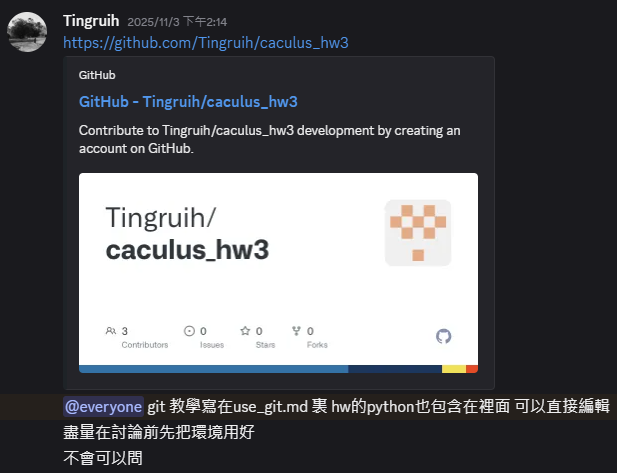
超強，胡同學幫我們把所有報告模板建立完成，我們只需下載給他網址即可，甚至還給很多教學影片給我們學，再不會問他。
### 11/05(三)
hw1成績出來有點低於我們的預期，最後決定問問助教大家平均(助教也每次問題超即時詳細回答我)，並且找出錯的部分，主要錯的是沒有檢查到很多題的錯誤，還有繳交作業錯誤，幫助我們這次作業很大(尤其是教授與助教的建議，版面的圖片不能太亂)。
### 11/06(四)
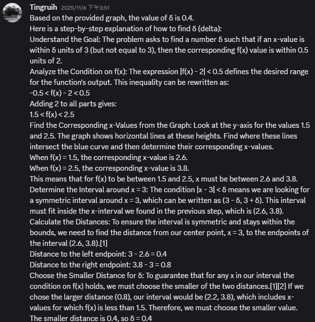
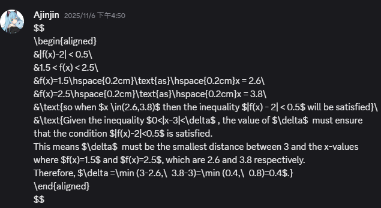
當天有meeting了一次，胡同學教了以下三點:<br>1.教怎麼用git解決了版本衝突問題<br>2.把遇到的問題更新在git教學文檔、修正latex排版問題、幫忙把ans敘述內容從\text移出來<br>3.幫黃同學解決code env問題、install pip包，告訴他可以在github上的檔案直接編輯程式。

use_git.md內容：
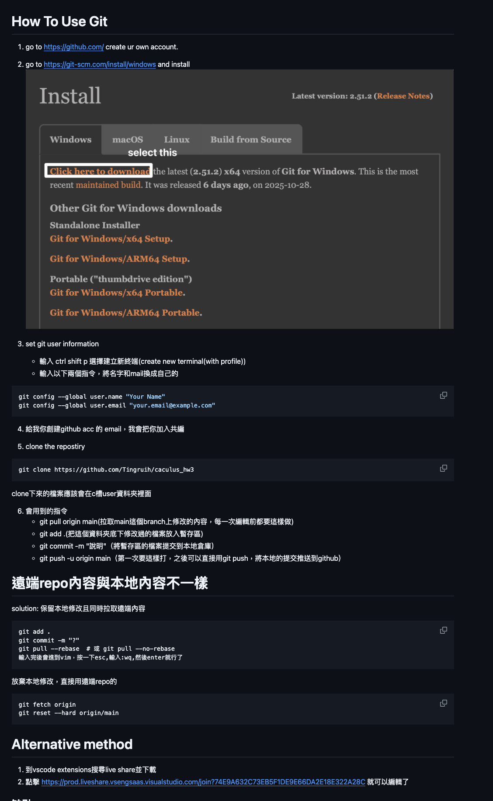

### 11/10(一)


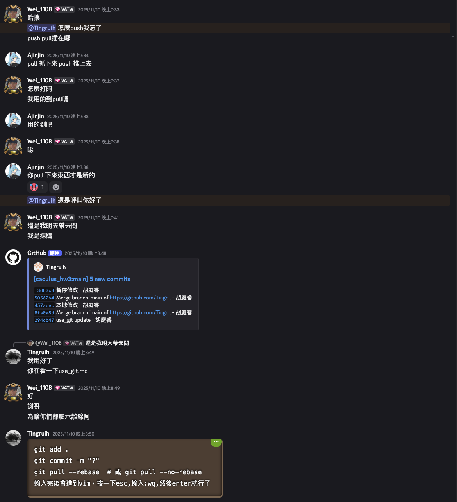
有人上傳過會push時會顯示error，蘇同學遇到此問題，所以請教胡同學，胡同學也有部分不知道，所以問AI，他們最終解決辦法是合併，先git commit -m"命名檔案"改的地方存到暫存庫，再git pull --rebase把別人部分拉下，最後push合併，蘇同學也學到一個要注意的，即VScode必須先存檔才能push。後來黃同學也開始問pull、push問題，他不知如何操作，所以已經學會的蘇同學非常認真的教他一遍，胡同學也有補充。

### 11/11(二)
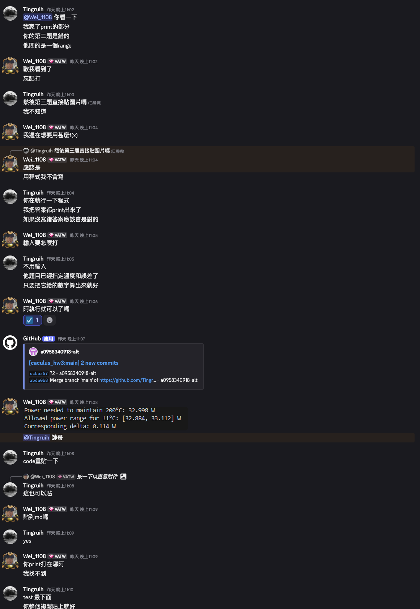
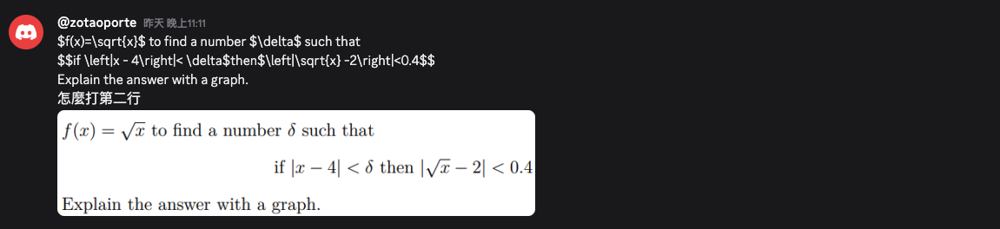
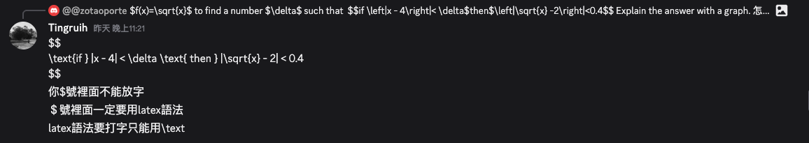
黃同學完成了程式部分，然而他第一次用VScode及寫python，不太懂溫度200的顯示或者要輸入在哪。胡同學告訴說不用輸入，還有幫其檢查出一些部份怪怪的，詢問他意見用作討論。而楊同學不知如何改markdowm形式，也不知如何在方程式$$之間用正常文字，胡同學也教用\text{}。

### 11/12(三)
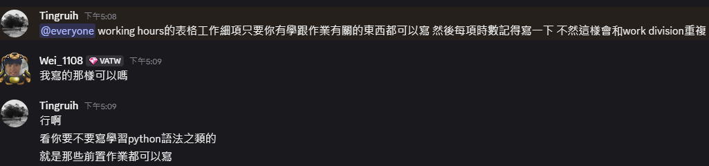
提醒working hours 要寫詳細，改正hw1的錯誤
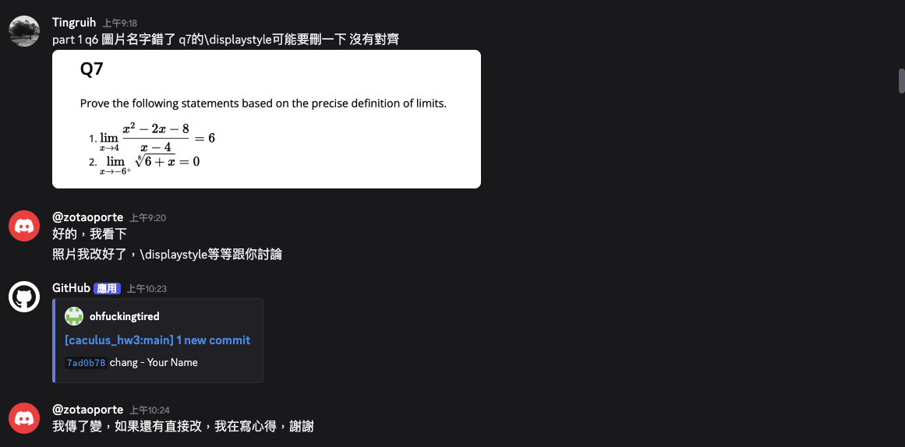
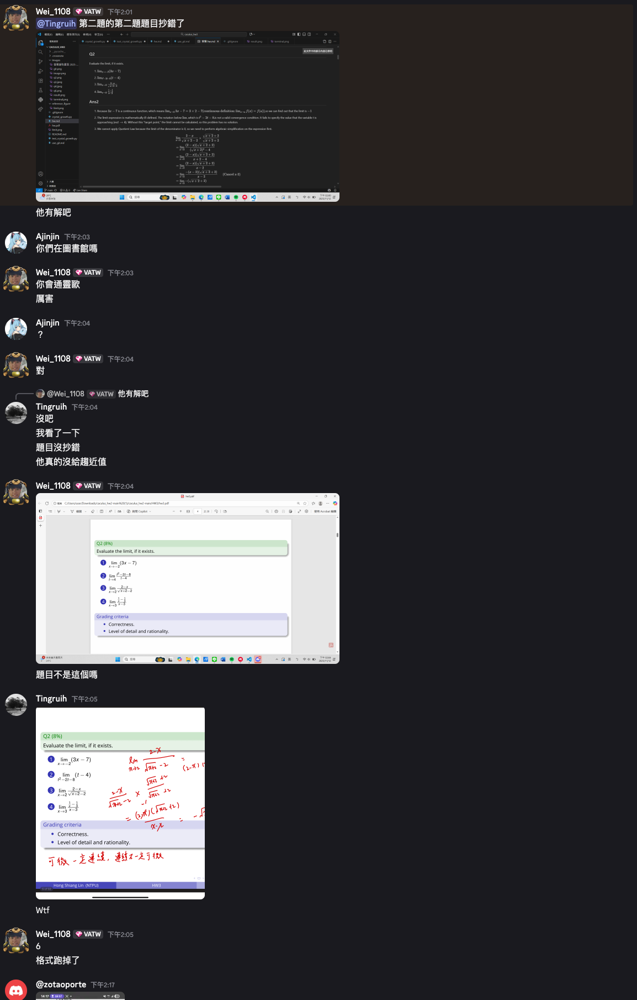
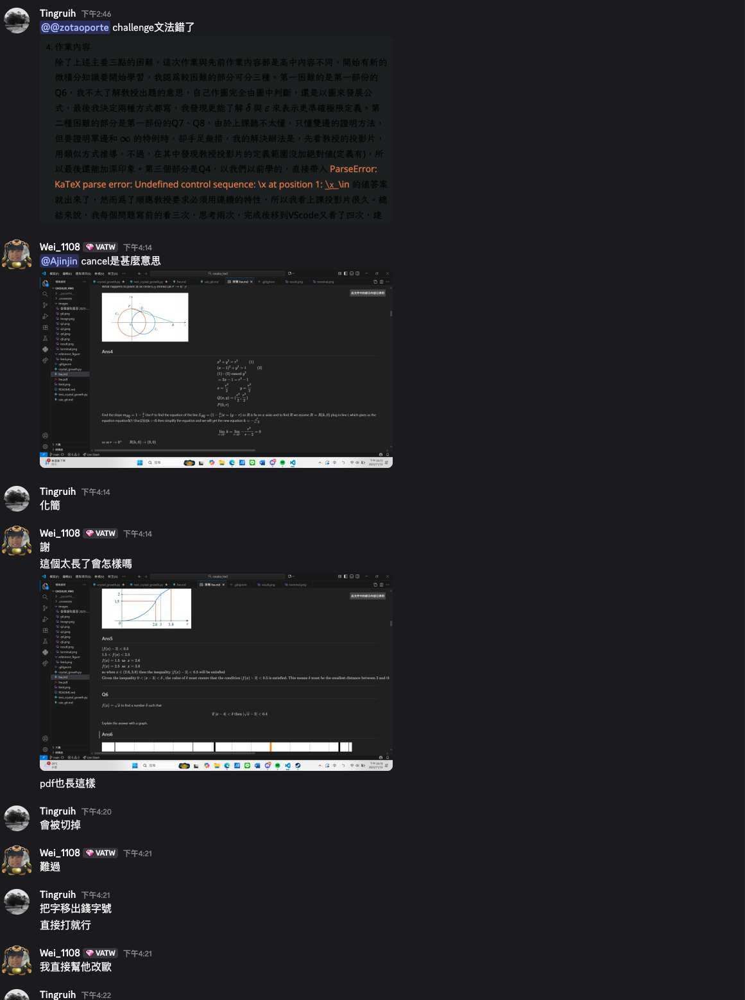
最後幫忙互相review報告，確認是否有錯誤的地方

# Appendix D
作業github連結:https://github.com/Tingruih/caculus_hw3/tree/main


