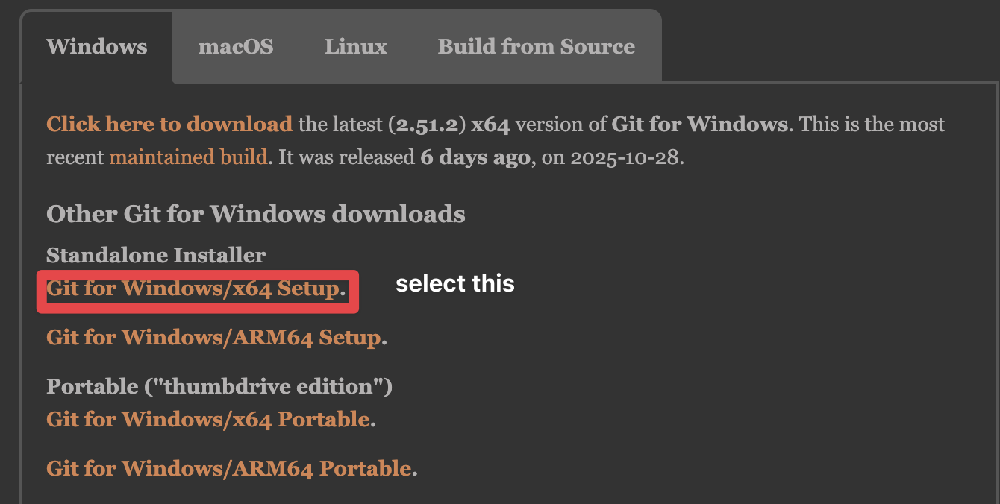

# How To Use Git

1. go to [https://github.com/](https://github.com/) create ur own account.
2. go to [https://git-scm.com/install/windows](https://git-scm.com/install/windows) and install 

3. set git user information
   * 輸入 ctrl shift p 選擇建立新終端(create new terminal(with profile))
   * 輸入以下兩個指令，將名字和mail換成自己的
```Bash
git config --global user.name "Your Name"
git config --global user.email "your.email@example.com"
```


4. 給我你創建github acc 的 email，我會把你加入共編

5. clone the repostiry
```Bash
git clone https://github.com/Tingruih/caculus_hw3
```

6. 會用到的指令
    * git pull origin main(拉取main這個branch上修改的內容，每一次編輯前都要這樣做)
    * git add .(把這個資料夾底下修改過的檔案放入暫存區)
    * git commit -m "說明"（將暫存區的檔案提交到本地倉庫）
    * git push -u origin main（第一次要這樣打，之後可以直接用git push，將本地的提交推送到github）

# Alternative method
1. 到vscode extensions搜尋live share並下載
2. 點擊 https://prod.liveshare.vsengsaas.visualstudio.com/join?74E9A632C73EB5F1DE9E66DA2E18E322A28C 就可以編輯了
## 缺點 
需等創建server的人同意才可以編輯
